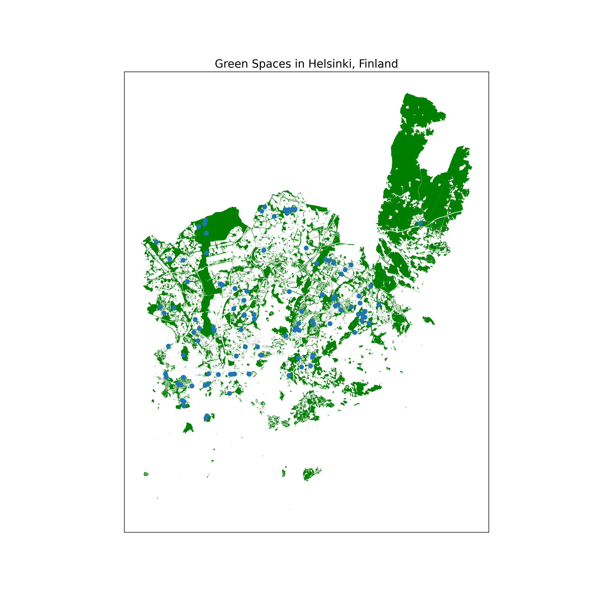

# GreenPulse 🌍

GreenPulse is a comprehensive urban analysis tool that empowers users to make sustainable choices by providing deep insights into city infrastructure and green spaces. By leveraging the power of **Google AI** and **OSMnx**, GreenPulse analyses urban layouts to generate detailed reports on sustainability, walkability, and green coverage.

## 🌟 Key Features

*   **AI-Powered Sustainability Analysis**: Utilises Google's Gemini Pro to generate comprehensive reports on a city's environmental health.
*   **Detailed Maps**: Generates interactive maps highlighting green areas, water bodies, and leisure spots using Folium and OSMnx.
*   **City Comparison**: Compare two cities side-by-side to see which one aligns better with your sustainability goals.
*   **Green Score**: An AI-evaluated score that ranks cities based on their green infrastructure and eco-friendliness.

## 🛠️ Technology Stack

*   **Backend**: Django 5.2 (Python)
*   **AI Engine**: Google Generative AI 
*   **Data Analysis**: Pandas, NumPy
*   **Mapping & Geospatial**: OSMnx, Folium, Branca, XYZServices
*   **Frontend**: HTML5, CSS3, Jinja2
  

